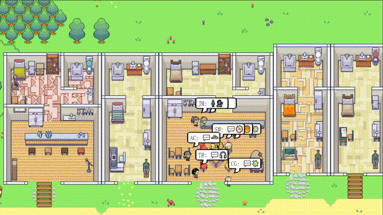

# CRSEC
A novel agent architecture to facilitate the emergence of social norms within a generative agent society.



## Setting Up the Environment 

To set up your environment, you will need to generate a `utils.py` file that contains your OpenAI API key and download the necessary packages.

### Step 1. Generate Utils File

In the `reverie/backend_server` folder (where `reverie.py` is located), create a new file titled `utils.py` and copy and paste the content below into the file:

```
# Copy and paste your OpenAI API Key
openai_api_key = "<Your OpenAI API>"
# Put your name
key_owner = "<Name>"

maze_assets_loc = "../../environment/frontend_server/static_dirs/assets"
env_matrix = f"{maze_assets_loc}/the_ville/matrix"
env_visuals = f"{maze_assets_loc}/the_ville/visuals"

fs_storage = "../../environment/frontend_server/storage"
fs_temp_storage = "../../environment/frontend_server/temp_storage"

collision_block_id = "32125"

# Verbose 
debug = True
```

Replace `<Your OpenAI API>` with your OpenAI API key, and `<name>` with your name.

### Step 2. Install requirements.txt

Install everything listed in the `requirements.txt` file (I strongly recommend first setting up a virtualenv as usual). A note on Python version: we tested our environment on Python 3.9.7. 

## Running a Simulation 

To run a new simulation, you will need to concurrently start two servers: the environment server and the agent simulation server.

### Step 1. Starting the Environment Server

Again, the environment is implemented as a Django project, and as such, you will need to start the Django server. To do this, first navigate to `environment/frontend_server` (this is where `manage.py` is located) in your command line. Then run the following command:

    python manage.py runserver

Then, on your favorite browser, go to [http://localhost:8000/](http://localhost:8000/). If you see a message that says, "Your environment server is up and running," your server is running properly. Ensure that the environment server continues to run while you are running the simulation, so keep this command-line tab open!

### Step 2. Starting the Simulation Server

Open up another command line (the one you used in Step 1 should still be running the environment server, so leave that as it is). Navigate to `reverie/backend_server` and run `reverie.py`.

    python reverie.py

This will start the simulation server. A command-line prompt will appear, asking the following: "Enter the name of the forked simulation: ". To start a 10-agent simulation without any initial norm, type the following:

    base_the_ville_n10

The prompt will then ask, "Enter the name of the new simulation: ". Type any name to denote your current simulation (e.g., just "test-simulation" will do for now).

    test-simulation

Initialization will then started.

### Step 3. Creating norms for entrepreneurs

After the initialization, the prompt will ask the following: "Regenerate norms? (y or n): ". To generate norms for an norm entrepreneur, type "y", otherwise, type "n".

```
# generate norms
y
# otherwise
n
```

If you chose "y" in the last step, the prompt will then ask, "Enter the name of the entrepreneur: ". Type a name of an agent who's identify is  "entrepreneur". In our setup, there are 3 norm entrepreneurs: Abigail Chen, Bob Johnson and Francisco Lopez. Type the name of any one of them to complete a generation round.

```
# e.g.,
Abigail Chen
```

After completing norm generation, it will prompt "Regenerate norms? (y or n):" again. Type "y" to either generate norms for another entrepreneur or redo the generation for the current agent. When all norm generation is complete, type"n" to end this stage.

Then it will display the following prompt: "Enter option: "

### Step 4. Running and Saving the Simulation

On your browser, navigate to [http://localhost:8000/simulator_home](http://localhost:8000/simulator_home). You should see the map of Smallville, along with a list of active agents on the map. You can move around the map using your keyboard arrows. Please keep this tab open. To run the simulation, type the following command in your simulation server in response to the prompt, "Enter option":

    run <step-count>

Note that you will want to replace `<step-count>` above with an integer indicating the number of game steps you want to simulate. For instance, if you want to simulate 100 game steps, you should input `run 100`. One game step represents 10 seconds in the game.


Your simulation should be running, and you will see the agents moving on the map in your browser. Once the simulation finishes running, the "Enter option" prompt will re-appear. At this point, you can simulate more steps by re-entering the run command with your desired game steps, exit the simulation without saving by typing `exit`, or save and exit by typing `fin`.

The saved simulation can be accessed the next time you run the simulation server by providing the name of your simulation as the forked simulation. This will allow you to restart your simulation from the point where you left off.

### Step 5. Replaying a Simulation

You can replay a simulation that you have already run simply by having your environment server running and navigating to the following address in your browser: `http://localhost:8000/replay/<simulation-name>/<starting-time-step>`. Please make sure to replace `<simulation-name>` with the name of the simulation you want to replay, and `<starting-time-step>` with the integer time-step from which you wish to start the replay.

For instance, by visiting the following link, you will initiate a pre-simulated example, starting at time-step 1:  [http://localhost:8000/replay/the_ville_n10_with_norm_day_1_19/1/](http://localhost:8000/replay/the_ville_n10_with_norm_day_1_19/1/)

### Step 5. Demoing a Simulation

You may have noticed that all character sprites in the replay look identical. We would like to clarify that the replay function is primarily intended for debugging purposes and does not prioritize optimizing the size of the simulation folder or the visuals. To properly demonstrate a simulation with appropriate character sprites, you will need to compress the simulation first. To do this, open the `compress_sim_storage_norm.py` file located in the `reverie/backend_server` directory using a text editor. Then, execute the `compress` function with the name of the target simulation as its input. By doing so, the simulation file will be compressed, making it ready for demonstration.

To start the demo, go to the following address on your browser: `http://localhost:8000/demo/<simulation-name>/<starting-time-step>/<simulation-speed>`. Note that `<simulation-name>` and `<starting-time-step>` denote the same things as mentioned above. `<simulation-speed>` can be set to control the demo speed, where 1 is the slowest, and 5 is the fastest. For instance, visiting the following link will start a pre-simulated example, beginning at time-step 1, with a medium demo speed:  [http://localhost:8000/demo/the_ville_n10_with_norm_day_1_19/1/3/](http://localhost:8000/demo/the_ville_n10_with_norm_day_1_19/1/3/)

## Simulation Storage Location

All simulations that you save will be located in `environment/frontend_server/storage`, and all compressed demos will be located in `environment/frontend_server/compressed_storage`. 
